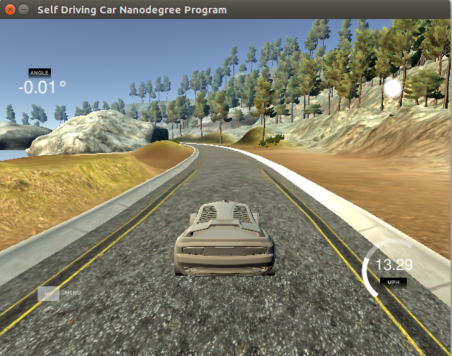
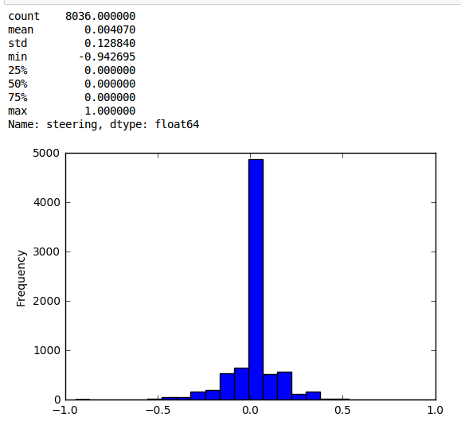
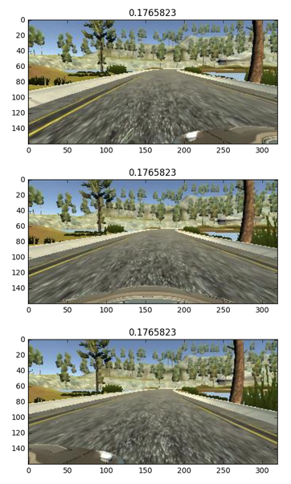
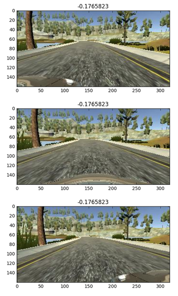
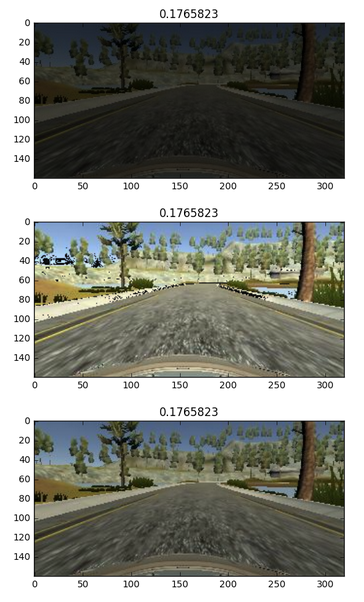
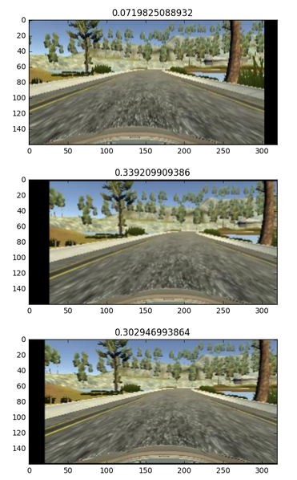
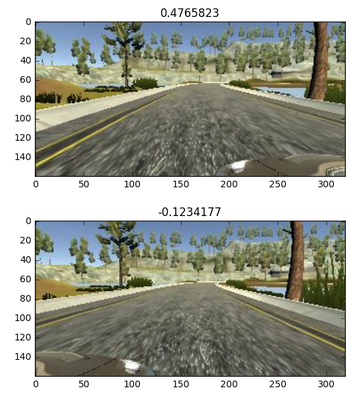
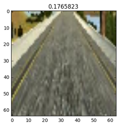
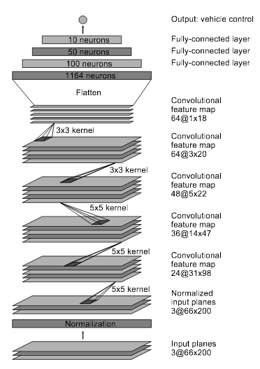

# Self-Driving Car Simulator Behavioural Cloning

## Outline
1. Objective
2. Data Recording
3. Data Augmentation and Processing
4. Model
5. Model Training
6. Model Testing
7. Conclusion.
8. Resources

## Objective

Project 3 of Udacity’s self-driving car Nano-degree is to mimic the human driving of a car on simulator using deep learning, the deep learning model should be trained to predict the appropriate steering angle to keep the car in the middle of the track feeding it with images of a camera fixed to the center of the car. The deep learning model have to learn the rule of controlling the steering wheel angle and general behavior for the new unseen data.

## Data Recording

I used the data provided by Udacity for track 1, [Data visualization is available in the notebook data-exploration.ipynb](data-exploration.ipynb).
Provided data samples are 3 images(center, left and right camera) for every steering angle, the majority of the provided data are with 0 steering angle which means if the data used without augmentation that would lead the model to overfit and may lead the model to be trained to always tend to output a 0 angle, but I think the goal is to train the model how to permanently correct the car to be within the track not to be biased to give a 0 angle output.

#### One way to avoid that is to use data Augmentation and generate a new training data from a smaller data set.

## Data Augmentation and Processing

Data processing done into a generator (keras fit_generator) to allow real time processing of the data generating thousands of them while not needed to load all of them into memory. Inside the generation function I avoided the samples with zero angle for the purpose explained above.

### Data augmentation techniques used:
[Data visualization is available in the notebook data-exploration.ipynb](data-exploration.ipynb).

### 1- Flipping
Choosing randomly an image, flipping it and changing the sign of the predicted angle to simulate driving in the opposite direction.

### 2- Brightness augmentation
To help training the model to different day and night driving with different bightness parts of the track, I added images with different brightness by converting them first to HSV, randomly scaling up/down the V channel.

### 3- Horizontal and vertical shifts
To compensate for the translation in the steering angles and being in different horizontal positions on the track, the generator randomly chooses image, do a horizontal shift then adds an offset to the steering angle corresponding to that.

Also vertical shift done to simulate driving up or down the slope of the track.

### 4- Using left and right camera images
Choosing randomly left and right images, adding a small angle .3 to the left camera and subtract a small angle of 0.3 from the right camera. That will help to teach the model to correct the car to move from the left and right to the center of the track.

###  Preprocessing
Model feeded with cropped sample images to not feed it with unused features like the horizon and the car’s hood, then resize them to 64x64 pixels square images. Input images were split to HSV planes before been passed to the trained network.

## Model
Model architecture is built on NVIDIA’s model implemented in keras with Tensorflow backend. The model consists of 9 layers: a normalization layer, 5 convolutional layers and 3 fully connected layers. Converse to the Nvidia model, input image was 64x64 pixels square image (HSV planes). Dropout 0.5 has been added after every layer to avoid overfitting and make the model general enough with driving rules. An Adam optimizer was used for optimization and ELU for activation functions.

## Model Training

The model trained using a keras generator that takes random images from the Udacity provided data set, does the different data processing, augmentation and cropping then returns a batch of training images and steering angles.
Batch size of 128 has been chosen with training the model for 10 epochs. In each epoch, we generated 100K images.
I did not use validation, the used metric to choose the final model was if the model can drive the whole track 1 smoothly without any problems.

## Model Testing
For the performance of the model on the track 1 (which the original data was collected from), The model is able to drive the car around track 1 smoothly without any problems (tested with throttle speed 0.2)

For track 2, model passed the first 9 turns until the very tight right turn so I think the model needs to be more general to work on the second track.

[Embedded Youtube video for testing on track 1](https://www.youtube.com/watch?v=CfLo5hfHdxs)

## Conclusion
The NN model was able to learn by cloning human behaviour to drive on the same track it has been trained on, and also has a good degree of generalization to pass big part of a new track. Though the model only controls the steering angle, I strongly believe that it is not enough and it also has to control the throttle and the brake so it can drive with better performance on general tracks once it has been already taught the general rules of driving.

## Resources
- https://github.com/commaai/research/blob/master/train_steering_model.py
- http://images.nvidia.com/content/tegra/automotive/images/2016/solutions/pdf/end-to-end-dl-using-px.pdf
- https://medium.com/@tantony/training-a-neural-network-in-real-time-to-control-a-self-driving-car-9ee5654978b7#.6x63gaq3k
- https://medium.com/@acflippo/cloning-driving-behavior-by-augmenting-steering-angles-5faf7ea8a125#.6qhnsgj3e
- https://chatbotslife.com/using-augmentation-to-mimic-human-driving-496b569760a9#.4nify270j
- https://medium.com/@tjosh.owoyemi/behavioural-cloning-applied-to-self-driving-car-on-a-simulated-track-5365e1082230#.x35g2yj9g
