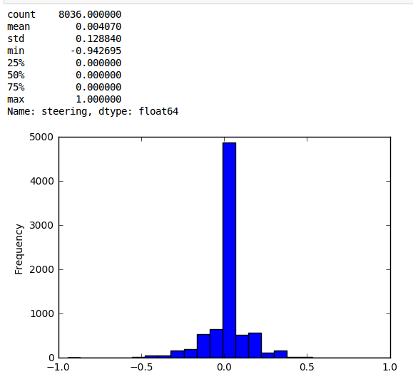
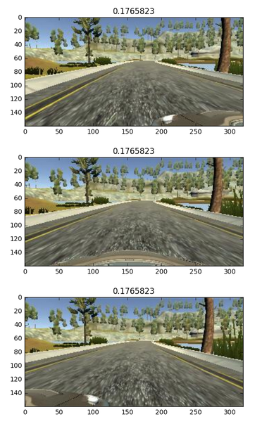
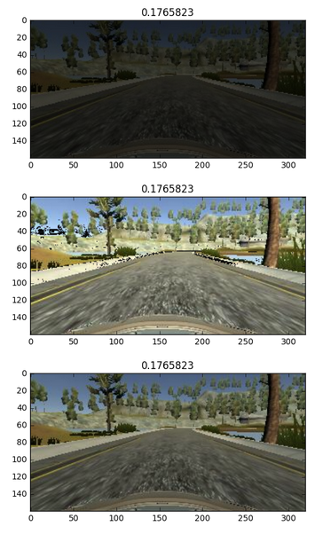
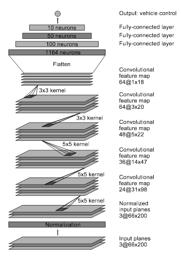

#**Behavioral Cloning Project 3** 


---

**Behavrioal Cloning Project**

The goals / steps of this project are the following:
* Use the simulator to collect data of good driving behavior
* Build, a convolution neural network in Keras that predicts steering angles from images
* Train and validate the model with a training and validation set
* Test that the model successfully drives around track one without leaving the road
* Summarize the results with a written report


## Rubric Points
###Here I will consider the [rubric points](https://review.udacity.com/#!/rubrics/432/view) individually and describe how I addressed each point in my implementation.  

---
# Files Submitted & Code Quality

## 1. Submission includes all required files and can be used to run the simulator in autonomous mode

My project includes the following files:
* model.py containing the script to create and train the model
* drive.py for driving the car in autonomous mode
* model.h5 containing a trained convolution neural network 
* writeup_report.md summarizing the results
* README.md file provides details of the approach taken for deriving and designing a model architecture fit for solving the given problem,  the characteristics and qualities of the architecture and how the model was trained and what the characteristics of the dataset are.
* data-exploration.ipynb provides information as how the dataset was generated and examples of images from the dataset.

## 2. Submssion includes functional code
Using the Udacity provided simulator and my drive.py file, the car can be driven autonomously around the track 1 by executing 
```sh
python drive.py model.h5
```

## 3. Submssion code is usable and readable

The model.py file contains the code for training and saving the convolution neural network. The file shows the pipeline I used for training the model, and it contains comments to explain how the code works.

# Model Architecture and Training Strategy

## 1. An appropriate model arcthiecture has been employed

My model consists of a convolution neural network built on NVIDIA’s model implemented in keras with Tensorflow backend. The model consists of 9 layers: a normalization layer, 5 convolutional layers and 3 fully connected layers. Converse to the Nvidia model, input image was 64x64 pixels square image (HSV planes) (model.py lines 170-228) 

The model includes ELU layers to introduce nonlinearity (code lines 198,212), and the data is normalized in the model using a Keras lambda layer (code line 180). 

## 2. Attempts to reduce overfitting in the model

The model contains Dropout 0.5 after every layer in order to reduce overfitting (model.py lines 201,213). 

The model was trained using a keras generator that takes random images from the Udacity provided data set, does the different data processing, augmentation and cropping then returns a batch of training images and steering angles.
Batch size of 128 has been chosen with training the model for 10 epochs. In each epoch, we generated 100K images. (code lines 35-167 and 241). 

For testing the model on the track 1 (which the original data was collected from), The model is able to drive the car around track 1 smoothly without any problems (tested with throttle speed 0.2)

For track 2, model passed the first 9 turns until the very tight right turn so I think the model needs to be more general to work on the second track.

## 3. Model parameter tuning

The model used an adam optimizer (model.py lines 220-225).

## 4. Appropriate training data


I used the data provided by Udacity for track 1, [Data visualization is available in the notebook data-exploration.ipynb](data-exploration.ipynb).
Provided data samples are 3 images(center, left and right camera) for every steering angle, the majority of the provided data are with 0 steering angle which means if the data used without augmentation that would lead the model to overfit and may lead the model to be trained to always tend to output a 0 angle, but I think the goal is to train the model how to permanently correct the car to be within the track not to be biased to give a 0 angle output.



#### One way to avoid that is to use data Augmentation and generate a new training data from a smaller data set.


### Data Augmentation and Processing

Data processing done into a generator (keras fit_generator) to allow real time processing of the data generating thousands of them while not needed to load all of them into memory. Inside the generation function I avoided the samples with zero angle for the purpose explained above.

#### Original training sample 3 cameras images with steering angle on the top:
 

### Data augmentation techniques used:
[Data visualization is available in the notebook data-exploration.ipynb](data-exploration.ipynb).

### 1- Flipping
Choosing randomly an image, flipping it and changing the sign of the predicted angle to simulate driving in the opposite direction.


### 2- Brightness augmentation
To help training the model to different day and night driving with different bightness parts of the track, I added images with different brightness by converting them first to HSV, randomly scaling up/down the V channel.



### 3- Horizontal and vertical shifts
To compensate for the translation in the steering angles and being in different horizontal positions on the track, the generator randomly chooses image, do a horizontal shift then adds an offset to the steering angle corresponding to that.

Also vertical shift done to simulate driving up or down the slope of the track.


### 4- Using left and right camera images
Choosing randomly left and right images, adding a small angle .3 to the left camera and subtract a small angle of 0.3 from the right camera. That will help to teach the model to correct the car to move from the left and right to the center of the track.


###  Preprocessing
Model feeded with cropped sample images to not feed it with unused features like the horizon and the car’s hood, then resize them to 64x64 pixels square images. Input images were split to HSV planes before been passed to the trained network.


# Model Architecture and Training Strategy

## 1. Solution Design Approach

My first step was to use a convolution neural network model similar to the Nvidia model, based on Nvidia paper.

I did not use validation during training, the used metric to choose the final model was if the model can drive the whole track 1 smoothly without any problems. Also testing if it is general enough with learning driving rules by observing the performance on a new unseen track (track 2).

To combat the overfitting, I modified the model by adding dropout 0.5 after every layer.

The final step was to run the simulator to see how well the car was driving around track one. At first the model was tending to not correct itself and gives 0 output steering angle but I think the goal is to train the model how to permanently correct the car to be within the track not to be biased to give a 0 angle output. So I avoided the samples with 0 steering angle and I generated augmented data as explained above from the rest of the samples and it helped to make the model more responsive to correct itself.

Also I found that cropping the unused info from the recorded images helps like the horizon and the car’s hood.

When I resized the images to be a square images (64x64) pixels instead of the shape used in the original Nvidia model (66x200), I noticed improvement in the model performance and also reduced the training time.

At the end of the process, the vehicle is able to drive autonomously around the track one smoothly without any problems (tested with throttle speed 0.2)

For track 2, model passed the first 9 turns until the very tight right turn so I think the model needs to be more general to work on the second track.

## 2. Final Model Architecture

The final model architecture (model.py lines 170-228)

Model architecture is built on NVIDIA’s model implemented in keras with Tensorflow backend. The model consists of 9 layers: a normalization layer, 5 convolutional layers and 3 fully connected layers. Converse to the Nvidia model, input image was 64x64 pixels square image (HSV planes). Dropout 0.5 has been added after every layer to avoid overfitting and make the model general enough with driving rules. An Adam optimizer was used for optimization and ELU for activation functions.




## 3. Creation of the Training Set & Training Process


Data processing done into a generator (keras fit_generator) to allow real time processing of the data generating thousands of them while not needed to load all of them into memory. Inside the generation function I avoided the samples with zero angle for the purpose explained above.

A keras generator that takes random images from the Udacity provided data set, does the different data processing, augmentation and cropping then returns a batch of training images and steering angles.
Batch size of 128 has been chosen with training the model for 10 epochs. In each epoch, we generated 100K images.
I did not use validation, the used metric to choose the final model was if the model can drive the whole track 1 smoothly without any problems.

